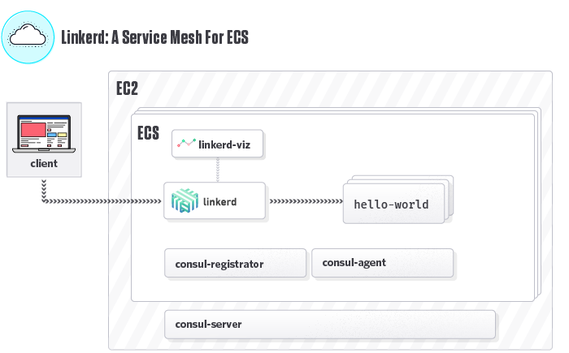
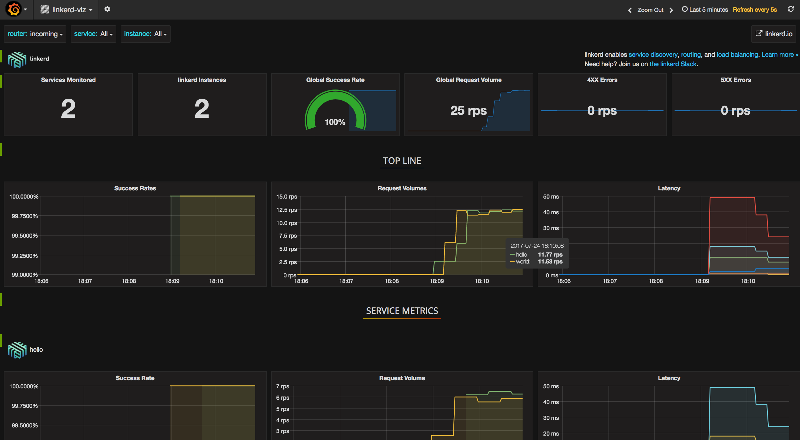

# 在ECS中运行

[亚马逊ECS][] 是一个容器管理服务。本指南将演示使用ECS中的linkerd路由和监控您的服务。

本指南中引用的所有命令和配置文件可以在 [linkerd-examples repo][] 中找到。

## 概述

本指南将演示在全新的ECS集群上搭建linkerd作为服务网格，consul作为服务发现，hello-world示例应用程序和用于监控的 linkerd-viz。

系统由以下组件组成：

- `ECS`: Docker容器管理。每个ECS实例运行以下Docker容器：

	- `linkerd`：代理请求到 `hello-world`
	- `consul-agent`：本地服务发现代理
	- `consul-registrator`：Docker和Consul之间的桥梁，自动使用consul注册服务

- `hello-world`： 示例ECS任务,在基础 `ECS` + `linkerd` + `consul-agent` 配置上单独部署，组成`hello`，`world` 和 `world-v2` 服务
- `linkerd-viz`：ECS任务, 在基础 `ECS` + `linkerd` + `consul-agent` 配置上单独部署, 为所有服务流量提供监控仪表板
- `consul-server`：服务发现后端，在单个EC2实例上运行


> Linerd in ECS

需要注意的是 `linkerd`，`consul-agent` 和 `consul-registrator` 在每个ECS节点上运行。在本指南的撰写之前，ECS调度程序并没有明确支持这一点。相反，我们使用AWS启动配置来引导每个ECS节点和这三个基础服务。我们仍然通过 `aws ecs start-task` 命令启动这些基础服务，因此它们将可见,作为运行的ECS容器。

## 初始搭建

本指南假设您已经将AWS配置为适用于ECS群集的IAM，密钥对和VPC。更多信息，请从这里开始：

http://docs.aws.amazon.com/AmazonECS/latest/developerguide/get-set-up-for-amazon-ecs.html

设置您将用于访问实例的密钥对，或者省略参数以放弃ssh访问。

```bash
KEY_PAIR=<MY KEY PAIR NAME>
```

创建安全组,以允许外部访问以下内容：

- ssh：22
- `linkerd` 路由：4140
- `linkerd` admin UI：9990
- `linkerd-viz`：3000
- `consul-agent` 和 `consul-serverUI`：8500

```bash
GROUP_ID=$(aws ec2 create-security-group --group-name l5d-demo-sg --description "Linkerd Demo" | jq -r .GroupId)
aws ec2 authorize-security-group-ingress --group-id $GROUP_ID \
  --ip-permissions \
  FromPort=22,IpProtocol=tcp,ToPort=22,IpRanges=[{CidrIp="0.0.0.0/0"}] \
  FromPort=4140,IpProtocol=tcp,ToPort=4140,IpRanges=[{CidrIp="0.0.0.0/0"}] \
  FromPort=9990,IpProtocol=tcp,ToPort=9990,IpRanges=[{CidrIp="0.0.0.0/0"}] \
  FromPort=3000,IpProtocol=tcp,ToPort=3000,IpRanges=[{CidrIp="0.0.0.0/0"}] \
  FromPort=8500,IpProtocol=tcp,ToPort=8500,IpRanges=[{CidrIp="0.0.0.0/0"}] \
  IpProtocol=-1,UserIdGroupPairs=[{GroupId=$GROUP_ID}]
```

安全组还打开节点之间的每个端口。有关节点间通信所需的所有端口的全面列表，请参考在 [linkerd-examples repo][] 中找到的ECS任务定义文件.

## Consul服务器

为了演示的目的，我们在ECS群集之外运行一个consul服务器。

```bash
aws ec2 run-instances --image-id ami-7d664a1d \
  --instance-type m4.xlarge \
  --user-data file://consul-server-user-data.txt \
  --placement AvailabilityZone=us-west-1a \
  --tag-specifications "ResourceType=instance,Tags=[{Key=Name,Value=l5d-demo-consul-server}]" \
  --key-name $KEY_PAIR --security-group-ids $GROUP_ID
```

我们用 `l5d-demo-consul-server` 标记这个实例。我们将在每个ECS节点上运行的 `consul-agent` 配置中引用此标签。这使得 `consul-agent` 能够找到 `consul-server`。

## ECS集群

创建一个名为 `l5d-demo` 的新ECS集群

```bash
aws ecs create-cluster --cluster-name l5d-demo
```

我们在引导ECS节点时引用 `l5d-demo`，指示他们加入我们刚创建的ECS集群。

### 角色政策

创建角色策略以允许ECS实例启动任务并描述实例。

```bash
aws iam put-role-policy --role-name ecsInstanceRole --policy-name l5dDemoPolicy --policy-document file://ecs-role-policy.json
```

我们需要 `ecs:StartTask` 能力，因为我们的启动配置将启动我们在每个ECS节点上的三个基础任务。我们需要  `ec2:DescribeInstances` 能力，因为 `consul-agent` 需要通过 `l5d-demo-consul-server` 实例标签来查找 `consul-server` 。

### 注册任务定义

这些任务定义描述了如何配置和引导所有五个应用程序。请注意，`hello-world` 描述三个独立的Docker容器，`hello`, `world`，和 `world-v2`。

```bash
aws ecs register-task-definition --cli-input-json file://linkerd-task-definition.json
aws ecs register-task-definition --cli-input-json file://linkerd-viz-task-definition.json
aws ecs register-task-definition --cli-input-json file://consul-agent-task-definition.json
aws ecs register-task-definition --cli-input-json file://consul-registrator-task-definition.json
aws ecs register-task-definition --cli-input-json file://hello-world-task-definition.json
```

### 创建启动配置

此步骤定义了启动配置。[ecs-user-data.txt][] 文件指示启动配置来配置和引导每个ECS节点上的 `linkerd`， `consul-agent` 以及 `consul-registrator`。

```bash
aws autoscaling create-launch-configuration \
  --launch-configuration-name l5d-demo-lc \
  --image-id ami-7d664a1d \
  --instance-type m4.xlarge \
  --user-data file://ecs-user-data.txt \
  --iam-instance-profile ecsInstanceRole \
  --security-groups $GROUP_ID \
  --key-name $KEY_PAIR
```

注意 [ecs-user-data.txt][] 文件为每个 `linkerd`，`consul-agent` 以及 `consul-registrator` 动态生成的配置文件, 使用它运行在其上的ECS实例的具体数据。

### 创建自动缩放组

根据上面定义的启动配置, 此步骤实际创建EC2实例。完成后，我们会有两个ECS节点，每个节点运行 `linkerd`，`consul-agent` 和 `consul-registrator`。

```bash
aws autoscaling create-auto-scaling-group \
  --auto-scaling-group-name l5d-demo-asg \
  --launch-configuration-name l5d-demo-lc \
  --min-size 1 --max-size 3 --desired-capacity 2 \
  --tags ResourceId=l5d-demo-asg,ResourceType=auto-scaling-group,Key=Name,Value=l5d-demo-ecs,PropagateAtLaunch=true \
  --availability-zones us-west-1a
```

我们命名我们的实例 `l5d-demo-ecs` 以便我们以后可以通过编程方式找到它们。

### 部署hello-world

现在我们已经部署了所有的基础服务，我们可以部署一个示例应用程序。该 `hello-world` 任务由 `hello` 服务，`world` 服务和 `world-v2` 服务组成。为了演示业务间通信，我们配置 `hello` 服务通过服务linkerd来呼叫 `world` 。

```bash
aws ecs run-task --cluster l5d-demo --task-definition hello-world --count 2
```

请注意，我们已经部署了两个实例 `hello-world`，它们生成两个 `hello` 容器，两个 `world` 容器和两个 `world-v2` 容器。


## 验证所有工作

通过 `l5d-demo-ecs` 名称, 我们选择任意ECS节点，然后用 curl 通过linkerd 访问 `hello` 服务：

```bash
# Select an ECS node
ECS_NODE=$( \
  aws ec2 describe-instances \
    --filters Name=instance-state-name,Values=running Name=tag:Name,Values=l5d-demo-ecs \
    --query Reservations[*].Instances[0].PublicDnsName --output text \
)

# test routing via linkerd
http_proxy=$ECS_NODE:4140 curl hello
Hello (172.31.20.160) World (172.31.19.35)!!

# view linkerd and Consul UIs (osx)
open http://$ECS_NODE:9990
open http://$ECS_NODE:8500
```

我们刚刚测试的请求流程：

`curl` -> `linkerd` -> `hello` -> `linkerd` -> `world`

### 测试动态请求路由

我们的 `hello-world` 任务还包括一项 `world-v2` 服务，我们来测试每请求路由：

```bash
http_proxy=$ECS_NODE:4140 curl -H 'l5d-dtab: /svc/world => /svc/world-v2' hello
Hello (172.31.20.160) World-V2 (172.31.19.35)!!
```

通过设置 `l5d-dtab` header，我们指示 linkerd 动态路由所有目的地为 `world` 的请求到 `world-v2`。


> linkerd请求路由

更多信息，请参阅 [动态请求路由][]。

### linkerd-viz

linkerd-viz 收集并显示所有 `linkerd` 在群集中运行的指标。在部署之前，让我们给系统一点负载：

```bash
while true; do http_proxy=$ECS_NODE:4140 curl -s -o /dev/null hello; done
```

现在部署一个单独的 `linkerd-viz` 实例：

```bash
aws ecs run-task --cluster l5d-demo --task-definition linkerd-viz --count 1

# find the ECS node running linkerd-viz
TASK_ID=$(aws ecs list-tasks --cluster l5d-demo --family linkerd-viz --desired-status RUNNING --query taskArns[0] --output text)
CONTAINER_INSTANCE=$(aws ecs describe-tasks --cluster l5d-demo --tasks $TASK_ID --query tasks[0].containerInstanceArn --output text)
INSTANCE_ID=$(aws ecs describe-container-instances --cluster l5d-demo --container-instances $CONTAINER_INSTANCE --query containerInstances[0].ec2InstanceId --output text)
ECS_NODE=$(aws ec2 describe-instances --instance-ids $INSTANCE_ID --query Reservations[*].Instances[0].PublicDnsName --output text)

# view linkerd-viz (osx)
open http://$ECS_NODE:3000
```

如果一切正常，我们会看到一个这样的仪表板：


> LINKERD-VIZ IN ECS

## 进一步阅读

关于配置linkerd的更多信息，请参阅 [linkerd配置][] 页面。

关于linkerd-viz的更多信息，请参阅 [linkerd-viz GitHub repo][]。


[亚马逊ECS]:https://aws.amazon.com/ecs/
[linkerd-examples repo]:https://github.com/linkerd/linkerd-examples/tree/master/ecs
[ecs-user-data.txt]:https://github.com/linkerd/linkerd-examples/blob/master/ecs/ecs-user-data.txt
[动态请求路由]:https://linkerd.io/features/routing/
[linkerd配置]:https://linkerd.io/config/latest/linkerd
[linkerd-viz GitHub repo]:https://github.com/linkerd/linkerd-viz

